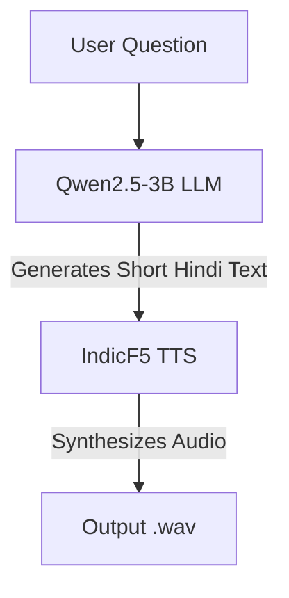

# 🇮🇳 Hindi LLM → TTS Web App

A high-fidelity, GPU-powered web application that answers questions in concise Hindi using **Qwen2.5-3B** and converts the response into natural speech using **IndicF5**.

> **Note**: This project prioritizes **speech quality and correctness** over low latency.

---

## ✨ Features

- **Multilingual Input**: Accepts questions in English, Hinglish, or Hindi.
- **Hindi Output**: Generates 1–2 line crisp responses in Devanagari script.
- **High-Quality TTS**: Uses IndicF5 for state-of-the-art Hindi voice cloning.
- **Modern Stack**: Built with FastAPI and a minimal, responsive web UI.
- **Audio Streaming**: Returns generated audio directly as WAV.
- **Observability**: Detailed console logs for request processing times.

---

## 🧠 Architecture



---

## ⚙️ Requirements

### Hardware
- **GPU**: NVIDIA A100 / A10 / T4 (or equivalent)
- **VRAM**: Minimum 16 GB recommended
- **OS**: Linux (Server or VM)

### Software
- **Python**: 3.10
- **Torch**: CUDA-enabled PyTorch
- **Hugging Face**: Account required for model access

---

## 📁 Project Structure

```text
IndicF5/
├── app.py                # FastAPI backend application
├── requirements.txt      # Python dependencies
├── README.md             # Project documentation
├── prompts/
│   └── ref.wav           # Reference audio for voice cloning
├── static/
│   └── index.html        # Frontend user interface
└── outputs/
    └── output.wav        # Generated audio output storage
```

---

## 🚀 Setup Instructions

### 1️⃣ Environment Setup

Create and activate a clean Conda environment:

```bash
conda create -n indicf5 python=3.10 -y
conda activate indicf5
```

> If `conda` is not found, source it first:
> ```bash
> source ~/miniconda3/etc/profile.d/conda.sh
> ```

### 2️⃣ Install Dependencies

Update pip and install required packages:

```bash
pip install --upgrade pip
pip install -r requirements.txt
```

Install GPU-optimized PyTorch:

```bash
pip install torch torchvision torchaudio --index-url https://download.pytorch.org/whl/cu118
```

Verify GPU visibility:
```bash
nvidia-smi
```

### 3️⃣ Hugging Face Authentication

Login to access the models (IndicF5 and Qwen):

```bash
huggingface-cli login
```
*Paste your Hugging Face **Read** access token when prompted.*

### 4️⃣ Configure Reference Voice

Place a clean Hindi audio sample in the `prompts/` directory.

- **File Path**: `prompts/ref.wav`
- **Requirements**:
  - Single speaker
  - Clear, noise-free voice
  - 5–15 seconds duration
  - **Important**: The transcript of this audio must *exactly* match the `REF_TEXT` variable in `app.py`.

---

## 🏃‍♂️ Running the Application

### Start the Server

```bash
uvicorn app:app --host 0.0.0.0 --port 8000
```

### Access the Web UI

Open your browser and navigate to:
`http://<SERVER_PUBLIC_IP>:8000`

---

## 🖥️ API Usage

You can interact with the backend programmatically:

```bash
curl -X POST http://<SERVER_IP>:8000/ask \
  -H "Content-Type: application/json" \
  -d '{"question":"भारत में यूपीआई कैसे काम करता है?"}' \
  --output output.wav
```

---

## 📊 Performance & Logging

The application provides detailed logs for monitoring performance:

| Metric | Typical Duration | Notes |
| :--- | :--- | :--- |
| **LLM Response** | < 1 sec | Qwen is extremely fast. |
| **TTS Synthesis** | 30–90 sec | IndicF5 is quality-first, not real-time. |
| **Total Request** | 30–90 sec | Depends on response length. |

**Example Log Output:**
```text
[INFO] User question: How does UPI work?
[INFO] LLM raw response: ...
[INFO] LLM final response: फोन से QR स्कैन करके भुगतान होता है।
[INFO] LLM time: 0.41s
[INFO] TTS time: 92.30s
[INFO] Total request time: 92.71s
```

> **Note**: The first request after startup may take longer due to model warm-up.

---

## ⚠️ Known Limitations

- **Language Support**: Best performance with pure Hindi text. Non-Hindi words may affect pronunciation.
- **Latency**: Not suitable for real-time conversation; designed for high-quality narration.
- **Concurrency**: GPU utilization involves burst inference.

---

## 🔮 Future Improvements

- [ ] Text sanitization before TTS
- [ ] Toggle for Short vs. Detailed answers
- [ ] Faster fallback TTS option
- [ ] Streaming audio output
- [ ] Authentication & rate limiting
- [ ] Docker containerization
